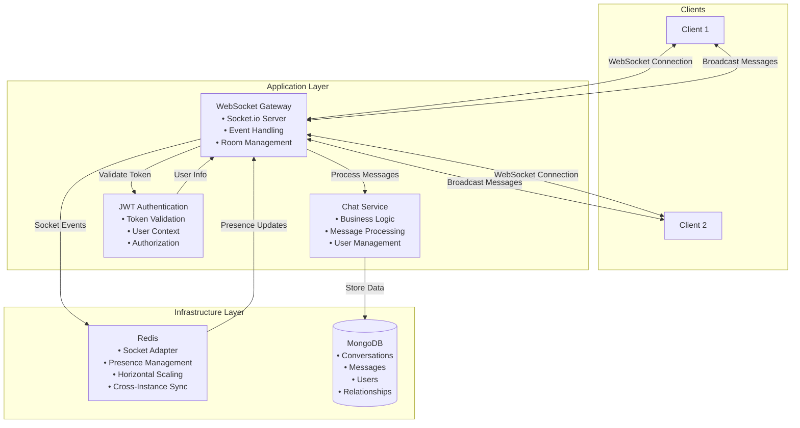

# SCRAT PROJECT

# Chat Architecture Diagram

```mermaid
graph TB
    subgraph "Clients"
        direction TB
        C1[Client 1]
        C2[Client 2]
    end

    subgraph "Application Layer"
        direction TB
        GW[WebSocket Gateway<br/>• Socket.io Server<br/>• Event Handling<br/>• Room Management]
        SVC[Chat Service<br/>• Business Logic<br/>• Message Processing<br/>• User Management]
        AUTH[JWT Authentication<br/>• Token Validation<br/>• User Context<br/>• Authorization]
    end

    subgraph "Infrastructure Layer"
        direction TB
        REDIS[Redis<br/>• Socket Adapter<br/>• Presence Management<br/>• Horizontal Scaling<br/>• Cross-Instance Sync]
        DB[(MongoDB<br/>• Conversations<br/>• Messages<br/>• Users<br/>• Relationships)]
    end

    %% Client connections
    C1 <-->|WebSocket Connection| GW
    C2 <-->|WebSocket Connection| GW

    %% Authentication flow
    GW -->|Validate Token| AUTH
    AUTH -->|User Info| GW

    %% Redis integration
    GW -->|Socket Events| REDIS
    REDIS -->|Presence Updates| GW

    %% Service layer
    GW -->|Process Messages| SVC
    SVC -->|Store Data| DB

    %% Real-time broadcast
    GW <-->|Broadcast Messages| C1
    GW <-->|Broadcast Messages| C2
```
